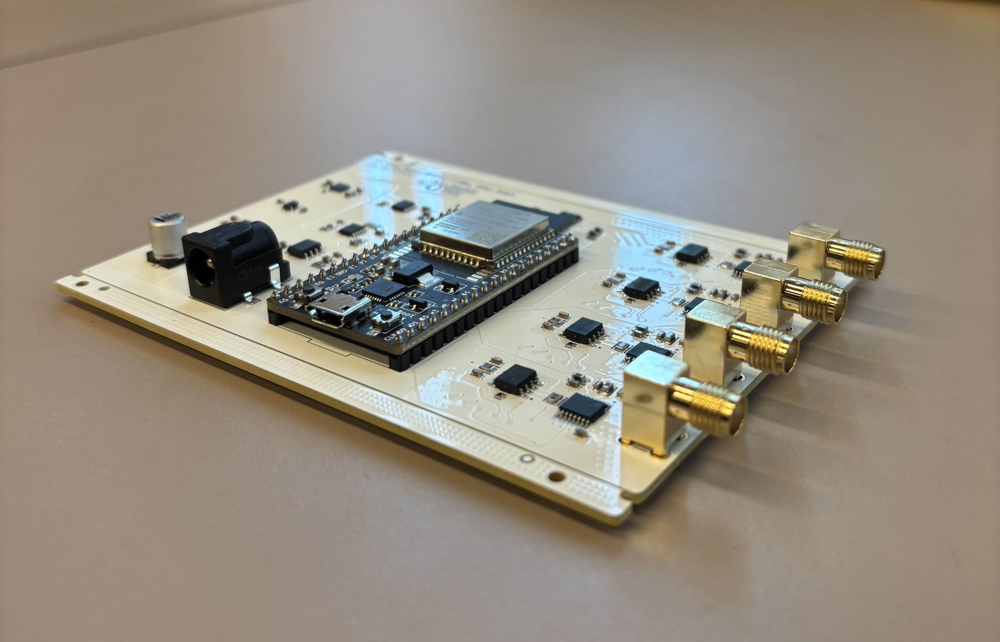

## Table of Contents
- [Overview](#overview-of-the-4-channel-snspd-biasing-current-source)
- [GUI Launch](#gui-launch)
  - [Install uv](#1-install-uv-python-package-and-project-manager)
  - [Create Python Environment](#2-create-python-environment)
    - [MacOS & linux](#macos--linux)
    - [Windows](#windows)
  - [Launch GUI](#3-launch-gui)
- [Firmware Setup](#firmware-setup)
  - [EIM Application Installation](#1-install-esp-idf-installation-manager-eim-application)
  - [EIM setup](#2-eim-setup)
  - [Flashing Firmware](#3-flashing-firmware)
- [Nix Flake](#nix-flake-for-nixos)

<br>

# Overview of the 4-channel SNSPD biasing current source



#### Objective:

SMU is used for SNSPD to: 
1. Determine switching current (Typically around $3 \mu A$) by hysteresis V-I sweep measurement
2. Source steady biasing current to the nano-wire

However, the commercial SMUs are typically **single channel**, and large sweep range it offers is unnecessary to source what SNSPD needs. 

This quasi-current source provides necessary features for SNSPD biasing with **4 channels** at around 200CAD per assembled PCB. 


#### Features:
- Hysteresis V-I sweep with controllable range (maximum $\pm 1.0 V$) 
    - With $100 k \Omega$ resistor down steam, current will be around $10 \mu A$ at $1.0V$
    - Measurement will be plotted on GUI and also saved as an CSV file 
- Steady biasing current sourcing at set voltage
- 4 channels independently controlled via GUI
- 10nA measurement precision
- ODR settings per channel

#### Requires:
- Assembled PCB 
- 9V / 1A Power Adapter (Current output higher than 1A is also fine)
- Micro USB cable
- Computer 
- $100k \Omega$ Resistor 
- Electrometer (Only for initial calibration)

<br>

# GUI Launch:

### 1. Install uv python package and project manager
**[uv Installation Guide](https://docs.astral.sh/uv/getting-started/installation)**

### 2. Create Python environment 

### MacOS & Linux 
Requires `libusb` installation.
- MacOS:

```bash
brew install libusb
```

- Linux (Use distro specific package manager):
```bash
sudo apt install libusb-1.0-0  
```

##### Activate venv
```bash
cd GUI/ 

uv sync 
source .venv/bin/activate 
```

### Windows:

```bash
cd \GUI

uv sync 
source .venv\Scripts\activate
```

### 3. Launch GUI
```bash
python3 main.py
```
GUI runs locally as an html file \
Default URL: `http://127.0.0.1:8006`

<br>

# GUI Instruction

## Connecting to ESP32

## Initial Calibration

## ODR Settings

## Steady Mode 

## Sweep Mode

### Hysteresis V-I plot


# Firmware Setup

### 1. Install ESP-IDF Installation Manager (EIM) Application

**[EIM GUI Installation Guide](https://dl.espressif.com/dl/eim/?tab=online)** \
\
Download GUI installer file for your device's OS 

### 2. EIM Setup 

1. Open the application
2. Select Easy Installation
3. Choose version `v.5.4.4`
4. Start installation

### 3. Flashing Firmware
1. Go to ESP-IDF Version Management in the application 
2. Open `IDF terminal` by clicking the laptop icon on the left
3. Move to the cloned repository
```bash
cd <YOUR_PATH>/SNSPD_multichannel_CurrentBias/Firmware/
```
4. Build firmware
```bash
idf.py set-target esp32
idf.py build
```
5. Connect laptop and ESP32 with micro USB cable
6. Flash firmware  

##### Single USB connection:
```bash
idf.py flash 
```

##### Multiple USB connections:
Need to specify the USB port with esp32 connection.

| OS | How to find it | Example |
|---|---|---|
| macOS | `ls /dev/tty.*` | `/dev/tty.usbserial-0001` |
| Linux | `ls /dev/tty*` | `/dev/ttyUSB0` |
| Windows | Device Manager → Ports (COM & LPT) | `COM3` |


```bash
idf.py -p <your_port> flash

#e.g. idf.py -p /dev/ttyUSB0 flash
```

##### Linux only
Need to add group for permission
```bash
sudo usermod -aG dialout $YOUR_USER
```
<br>

# Nix flake (For NixOS):

**[Nix installation guide](https://nix.dev/install-nix.html)** \
No need to separately install `uv` or `libusb`

```bash
cd GUI/ 
nix develop 
```
**Nix Flake:**

```bash
cd Firmware/
nix develop

#alias in flake
esp32 #idf.py set-target esp32
b     #idf.py build
f     #idf.py flash

bf    #idf.py build & flash
```
